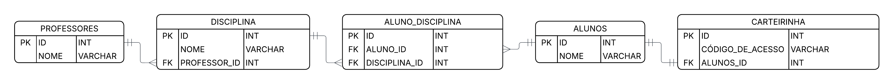

# 🏫 Sistema de Gestão Escolar (Banco de Dados SQL)

Este projeto consiste na **modelagem conceitual e implementação prática** de um banco de dados relacional para o gerenciamento de uma instituição de ensino. O sistema foi desenvolvido para organizar o fluxo de dados entre alunos, professores e o currículo acadêmico, garantindo a integridade referencial através de chaves estrangeiras (Foreign Keys).

## 📊 Modelagem (DER)

## 💡 Principais Funcionalidades:
* **Controle de Identidade:** Relacionamento **1:1** entre Alunos e Carteirinhas, garantindo que cada código de acesso seja único e vinculado a apenas um estudante.
* **Gestão de Corpo Docente:** Relacionamento **1:N** entre Professores e Disciplinas, permitindo que um professor lecione múltiplas matérias.
* **Grade Curricular Dinâmica:** Relacionamento **N:N** entre Alunos e Disciplinas, gerenciado por uma tabela associativa que permite a matrícula de diversos alunos em diversas matérias simultaneamente.

## 🛠️ Tecnologias Utilizadas:
* **MySQL** (SGBD)
* **MySQL Workbench** (Gerenciamento e Queries)
* **Lucidchart** (Modelagem Visual)

---
*Projeto desenvolvido para estudo de fundamentos de bancos de dados relacionais.*
